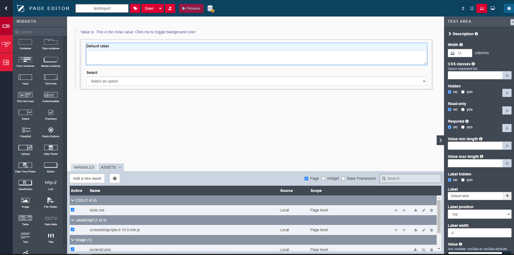

# Bonita UI designer 




Create your own pages for your Bonita application or your own project.


## Quick start

### Pre-requisite

* [Maven][maven]
* [Java 8][java] for compilation
or
* [Docker][docker]

### Build

#### Using Maven
* Build it using maven `mvn clean package`
* Run it using `java -jar backend/webapp/target/ui-designer-1.16.0-SNAPSHOT-standalone.jar`

#### Using Docker

* Build docker image:

        docker build -t bonita/ui-designer

* Run it :
    
        docker run --name uid -d -p 50000:8080 bonita/ui-designer

### Usage

Application is now available at http://localhost:50000/bonita/

Start creating your pages, take a look at the [Documentation][documentation].

## To go further


### How does it work

The UI-designer is composed of a Java backend application and an AngularJs frontend.
It is packaged in a war file and provided by default in the [Bonita Studio][studio-repo]

It produces standalone AngularJs pages that are compatible with Bonita platform.

## Contribute


### Report issues
If you want to report an issue or a bug use our [official bugtracker](https://bonita.atlassian.net/projects/BBPMC)


### How to contribute
Before contributing, read the [guidelines][contributing.md]

### Build and Test

#### Build

You can build entire project using maven.
    
    mvn clean package
    
This will build frontend and backend and create two artifacts :
backend/webapp/target/ui-designer-1.16.0-SNAPSHOT.war
backend/webapp/target/ui-designer-1.16.0-SNAPSHOT-standalone.jar

#### Test

while running `mvn clean package` only unit tests are run. 
If you want to run the integration tests, run the following command

    mvn clean install -Pintegration-test
    
Also frontend e2e test could be launched via

    mvn clean install -Pe2e

#### Run
To run build standalone jar, just launch it as a standard jar :

    java -jar backend/webapp/target/ui-designer-1.16.0-SNAPSHOT-standalone.jar [-Dworkspace=/path/to/workspace] [-Drepository.widgets=/path/widgets/repository] [-Drepository.pages=/path/pages/repository][-Dbonita.data.repository.origin=datarepository.url]


Application is now available at http://localhost:8080/designer/

You can specify workspace location where pages and widgets are stored. Default value is {user.home}/.bonita 

Available options can be listed by running 

    java -jar backend/webapp/target/ui-designer-1.16.0-SNAPSHOT-standalone.jar -h
    
Other available options are listed here : http://tomcat.apache.org/maven-plugin-2.0/executable-war-jar.html 
    
#### Develop
Backend and frontend side could be launched in dev mode by using _server.sh_ script. 
It launch _gulp serve_ backend task, waits for backend webabb to be running then launches _gulp serve_ frontend task.

```shell
$ ./server.sh
```

You can access the application at http://localhost:3000/index-dev.html, backend side is accessible at http://localhost:8080/bonita

#### Debug mode

How to debug backend with some breakpoint ?

### IntelliJ

Run `Start Backend` target configuration as debug mode.

Run `Start Frontend` target configuration to get liveReload on html/javascript frontend part.

## Command line

In backend run debug mode:
 
```shell
    mvn spring-boot:run -Dagentlib:jdwp=transport=dt_socket,server=y,suspend=n,address=8000
````

Go in your IDE, edit run configuration: Select `Remote`. Only change port value (5000 by default) to value display in your shell.
Run this configuration in debug.

In frontend, run:
```shell
    yarn start
````

Now you can debug your application with breakpoint.

#### Docker

You can run the ui-designer locally using Docker (of course, you need to install Docker to do so).
The Dockerfile is a really simple one, using a base image with java7, adding the build standalone jar and starting it.
Before building docker image, you need to build the project.

To build the image :

    docker build -t bonita/ui-designer .

To run the image built with the previous command :

    docker run -p 8080 bonita/ui-designer

This will start the builder on a random port on your docker host (*either the local host if you're running linux, or the boot2docker VM if you're on MacOS*). For boot2docker, you can find your VM IP with :

    boot2docker ip

You can find the random port used with :

    docker ps

For example, the application can start on [http://192.168.59.103:49153/designer](http://192.168.59.103:49153/designer)
(*192.168.59.103 being the default boot2docker IP and 49153 the random port used*).

You can also run the image on a fixed port, 8000 for example, with :

    docker run -p 8000:8080 bonita/ui-designer
    
    
    
## Resources

* [Documentation][documentation]


[maven]: https://maven.apache.org/
[java]: https://www.java.com/fr/download/
[docker]: https://www.docker.com/
[studio-repo]: https://github.com/bonitasoft/bonita-studio
[download]: https://www.bonitasoft.com/downloads
[documentation]: https://documentation.bonitasoft.com
[contributing.md]: https://github.com/bonitasoft/bonita-developer-resources/blob/master/CONTRIBUTING.MD

    
